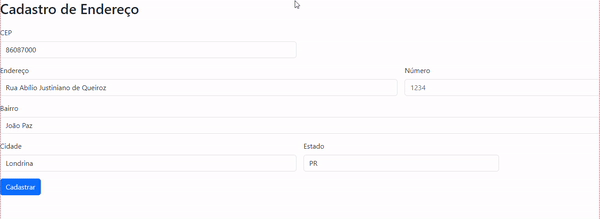
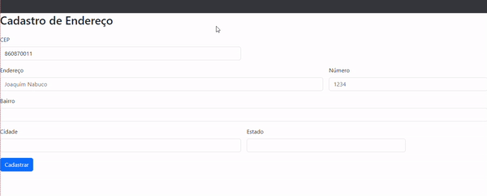

# Índice 

* [Formulário de Cadastro de Endereço](#formulario-de-cadastro-de-endereço)  
* [Descrição](#descri%C3%A7%C3%A3o) 
* [Funcionalidades](#Funcionalidades)  
* [Tecnologia Utilizadas](#tecnologia-utilizadas)  
* [Fontes Consultadas](#fontes-consultadas)  
* [Autores](#autores)  

# Formulário de Cadastro de Endereço
Projeto criado para aprendizado de API e Expressão Regular.

## Descrição
O Projeto Cadastro de Endereço, usa API da ViaCEP para que apartir do CEP do usuário seja preenchido os campos cidade, bairro, UF(estado) e logradouro. Foi utilizado API da ViaCEP, onde foi pego os códigos em JavaScript, foi utilizado Arrow Function, Expressão regular e também foi feito o uso de Bootstrap.

<<<<<<< HEAD
## 🛠️Funcionalidades
O Projeto contém 3 funcionalidades:

=======
## 🛠️Funcioanlidades
O Projeto contém 4 funcionalidades:
>>>>>>> 96f8f2cb7c9646da457dd486f92bf6762bf4d980
1.Preenchimento Automático.
    

No JS é representado pela função:
<<<<<<< HEAD
        const preencherFormulario = (endereco) => {
            document.getElementById('rua').value = endereco.logradouro;
            document.getElementById('bairro').value = endereco.bairro;
            document.getElementById('cidade').value = endereco.localidade;
            document.getElementById('estado').value = endereco.uf;
        }
Onde é pego as informações da API e preenchidas no formulário. 

2.Confimação do CEP e limpeza dos campos.
  

        //Verifica se o CEP é válido
        const eNumero = (numero) => /^[0-9]+$/.test(numero)
        const cepValido = (cep) => cep.length == 8 && eNumero(cep);
Verificação do CEP, com o uso de expressão regular, verifica se contém apenas números, e se possui 8 caracteres.

        //Limpa Formulário
        const limparFomulario = () => {
            document.getElementById('rua').value = '';
            document.getElementById('bairro').value = '';
            document.getElementById('cidade').value = '';
            document.getElementById('estado').value = '';
        }
Aqui é feito o limpeza dos campos onde o valor está igual a nada(ou null). Função Puxada assim que é concluído o consumo da API. 

3.Mensagens de Erros e Consumo da API.
    
    

        //  Função para consumo de API da VIACEP
        const pesquisarCEP = async() => {
            limparFomulario();
            const url = `http://viacep.com.br/ws/${cep.value}/json/`;

            if(cepValido(cep.value)){
                const dados = await fetch(url); 
                const address = await dados.json();

                if(address.hasOwnProperty('erro')){ 
                    alert("Cep não encontrado");
                }else{
                    preencherFormulario(address);
                }
            }else{
                alert("CEP incorreto");
            }
        }
Aqui é feito a verificação do CEP, onde caso haja algum erro o JS ira avisar com um ``alert``. O ``async`` indica que esta função será assíncrona, permitindo o uso de ``await``, assim podendo chamar a API. O ``fetch(url)`` consulta a API com o CEP e espera os dados em formato JSON. O método ``hasOwnProperty`` verifica se o objeto(``address``)possui uma propriedade específica(``erro``), caso tenha, ele retornar um alert de erro: ``alert("Cep não encontrado")``, caso contrario, ele executa a função ``preencherFormulario(address)`` com os dados recebidos da API.
=======

                const preencherFormulario = (endereco) => {
                    document.getElementById('rua').value = endereco.logradouro;
                    document.getElementById('bairro').value = endereco.bairro;
                    document.getElementById('cidade').value = endereco.localidade;
                    document.getElementById('estado').value = endereco.uf;
                }
Onde é pego as informações da API e preenchidas no formulário. 

2.Confimação do CEP e limpeza dos campos
  

            //Verifica se o CEP é válido
            const eNumero = (numero) => /^[0-9]+$/.test(numero)
            const cepValido = (cep) => cep.length == 8 && eNumero(cep);
Verificação do CEP, se contém apenas números, e se possui 8 números.

            //Limpa Formulário
            const limparFomulario = () => {
                document.getElementById('rua').value = '';
                document.getElementById('bairro').value = '';
                document.getElementById('cidade').value = '';
                document.getElementById('estado').value = '';
            }
Aqui é feito o limpeza dos campos onde o valor está igual a nada(null)

CEP não encontrado
    CEPnaoencontrado.gif

CEP incorreto
    CEPincorreto.gif

>>>>>>> 96f8f2cb7c9646da457dd486f92bf6762bf4d980

## 💻Tecnologia Utilizadas
- :heavy_check_mark: [HTML]
- :heavy_check_mark: [CSS]
- :heavy_check_mark: [JS]
- :heavy_check_mark: [BOOTSTRAP]
- :heavy_check_mark: [GIT]

## Autor
Aluno: Caio Estevão
- [github.com](https://github.com/Caioestevao1000)

### Auxílio
Professor: Leonardo Rocha
<<<<<<< HEAD
- [github.com](https://github.com/LeonardoRochaMarista)
=======
- Github: [github.com](https://github.com/LeonardoRochaMarista)
>>>>>>> 96f8f2cb7c9646da457dd486f92bf6762bf4d980
