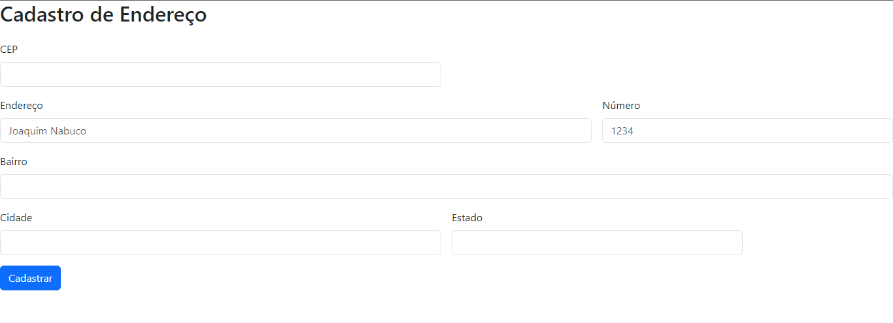
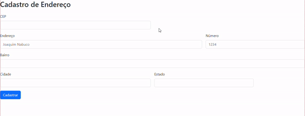

# Formuário de Cadastro de Endereço

# Projeto Cadastro de Endereço
Projeto criado para aprendizado de API.

## Introdução
O Projeto Cadastro de Endereço, usa API da ViaCEP para que apartir do CEP do usuário seja preenchido os campos cidade, bairro, UF(estado) e logradouro.

## 🛠️Funcioanlidades
O Projeto contém 4 funcionalidades:

<ol>
    <li>Inserção do CEP e preenchimento automático.
    
    No JS é representado pela função "preencherFormulario"</li>
    <li></li>
    <li></li>
    <li></li>
</ol>

## 💻Tecnologia Utilizadas
- :heavy_check_mark: [HTML]
- :heavy_check_mark: [CSS]
- :heavy_check_mark: [JS]
- :heavy_check_mark: [BOOTSTRAP]
- :heavy_check_mark: [GIT]
